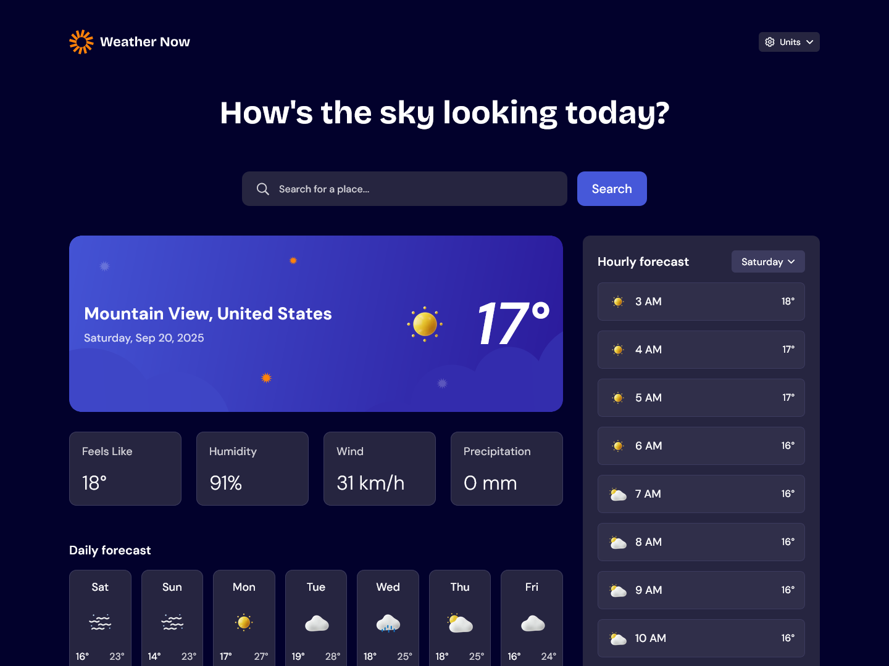

# Frontend Mentor - Weather app solution

This is a solution to the [Weather app challenge on Frontend Mentor](https://www.frontendmentor.io/challenges/weather-app-K1FhddVm49). Frontend Mentor challenges help you improve your coding skills by building realistic projects.

## Table of contents

- [Overview](#overview)
  - [The challenge](#the-challenge)
  - [Screenshot](#screenshot)
  - [Links](#links)
- [My process](#my-process)
  - [Built with](#built-with)
  - [What I learned](#what-i-learned)
- [Author](#author)
- [Setup](#setup)

## Overview

### The challenge

Users should be able to:

- Search for weather information by entering a location in the search bar
- View current weather conditions including temperature, weather icon, and location details
- See additional weather metrics like "feels like" temperature, humidity percentage, wind speed, and precipitation amounts
- Browse a 7-day weather forecast with daily high/low temperatures and weather icons
- View an hourly forecast showing temperature changes throughout the day
- Switch between different days of the week using the day selector in the hourly forecast section
- Toggle between Imperial and Metric measurement units via the units dropdown
- Switch between specific temperature units (Celsius and Fahrenheit) and measurement units for wind speed (km/h and mph) and precipitation (millimeters) via the units dropdown
- View the optimal layout for the interface depending on their device's screen size
- See hover and focus states for all interactive elements on the page

### Screenshot



### Links

- Solution URL: [Solution](https://www.frontendmentor.io/solutions/weather-app-using-nuxt-and-tailwind-TX_VpsuDcZ)
- Live Site URL: [Live site](https://weather-now.leeconnelly.dev)

## My process

1. Send requests to Meteo API and parse data into a usable format
2. Display data in HTML
3. Style with CSS
4. Move parsing logic from app.vue into components
5. Geolocate using IP address on page load

### Built with

- [Nuxt](https://nuxt.com) - Vue framework
- [Tailwind](https://tailwindcss.com) - CSS framework
- [Open-Meteo](https://open-meteo.com) - Weather API
- [ip-api](https://ip-api.com) - IP lookup API

### What I learned

When the page loads for the first time, a request is sent to an API to geolocate using the user's IP address. <br>
To avoid excessive calls, a cookie is set after the first request to remember the coordinates. <br>
However, when calling an API route using useFetch, Nuxt doesn't actually send a HTTP request, instead it calls the method directly, because of this you're not able to set cookies in the server route. Instead, I'm setting the cookie on the frontend.

## Author

- Website - [Lee Connelly](https://leeconnelly.dev)
- Frontend Mentor - [@LeeConnelly12](https://www.frontendmentor.io/profile/LeeConnelly12)

## Setup

Make sure to install dependencies:

```bash
# npm
npm install

# pnpm
pnpm install

# yarn
yarn install

# bun
bun install
```

## Development Server

Start the development server on `http://localhost:3000`:

```bash
# npm
npm run dev

# pnpm
pnpm dev

# yarn
yarn dev

# bun
bun run dev
```
